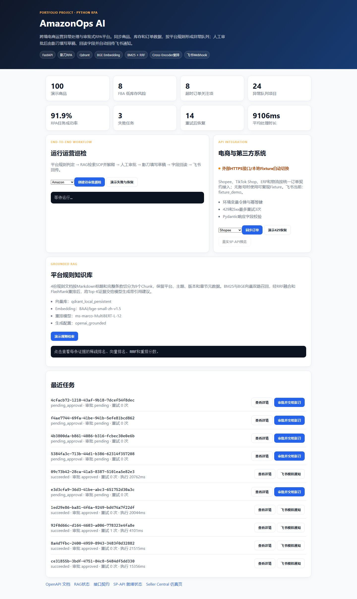
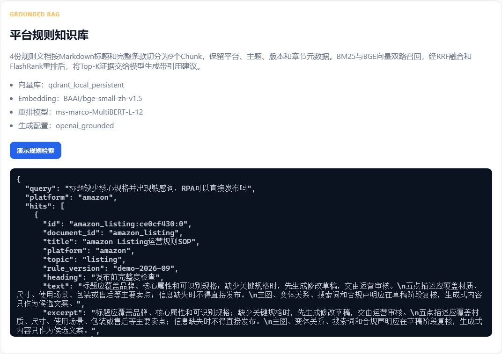
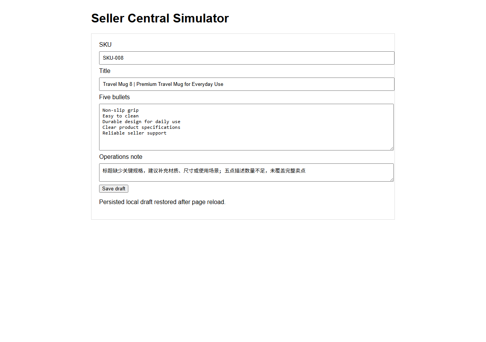

# AmazonOps AI

跨境电商运营异常处理与审批式RPA平台。系统同步商品、库存和非PII订单状态，形成Listing、库存与履约异常队列；运营人员选择Listing异常并审批后，RPA才填写本地Seller Central仿真后台、保存草稿、刷新回读字段，并生成截图、Trace、报告和飞书兼容通知。

## 已验证结果

| 项目 | 结果 |
| --- | ---: |
| 商品 | 100 |
| 订单 | 800 |
| 30天库存快照 | 3000 |
| 标注异常 | 24，Listing、库存、订单各8条 |
| 固定合成标注集 | Precision 1.0、Recall 1.0、F1 1.0 |
| 自动化测试 | 41 passed |
| HTTP限流恢复 | 前2次429，第3次同步100条库存记录 |
| Chromium闭环 | 首次受控失败，第2次恢复并保存草稿 |
| 飞书通知 | RPA成功后自动发送；支持真实Webhook与Fixture切换 |
| 规则知识库 | 4份Markdown文档，按章节与完整条款切为9个Chunk |
| RAG Chunk级评测 | 30条：Recall@1 0.8667、Recall@3 1.0、MRR 0.9333 |
| 目标引用命中 | 1.0 |
| 无证据拒答 | 12条：拒答率1.0，含域外问题与知识库未覆盖的电商问题 |

评测指标来自固定合成数据，用于证明规则、队列和评测链路可复现，不代表真实店铺准确率。

## 界面与执行证据







## 业务闭环

    多平台与ERP数据同步
        → 数据字段校验与异常检测
        → SQLite异常队列
        → 平台规则引擎判定异常
        → Qdrant中BM25与BGE向量双路召回
        → RRF融合与Cross-Encoder重排
        → AI选择引用与动作，服务端生成受控建议
        → 人工选择SKU并审批
    → 后端事件触发影刀填写Listing草稿
        → 页面刷新与字段回读
        → 截图、Trace和审计报告
        → 飞书兼容通知与指标看板
        → 失败重试或人工处理

RPA只保存本地仿真草稿，不发布商品、不调价、不发货、不退款。

## 主要实现

- FastAPI和SQLite记录任务、审批、步骤、重试和审计证据。
- Amazon、Shopee、TikTok Shop、ERP和物流共用商品、库存、订单同步契约。
- Shopee、TikTok Shop、ERP和物流可通过环境变量切换外部HTTPS端点；未配置时自动使用本地Fixture。
- Amazon、Shopee、TikTok Shop的Listing完整度和订单时效采用可测试的确定性规则；RAG不直接判罚，只返回SOP引用和处理解释。
- 4份Markdown规则按标题、章节和完整条款切分，保留平台、主题、版本、章节元数据；相邻Chunk重叠一条完整规则，不按字符截断。
- Qdrant本地持久化保存`BAAI/bge-small-zh-v1.5`向量，BM25与向量各自召回后通过RRF融合，再由FlashRank `ms-marco-MultiBERT-L-12`评分，并结合RRF得到最终排序。
- Top-K证据注入OpenAI兼容模型生成结构化引用选择与动作；代码校验引用ID、动作白名单和危险动作表述，最终答复只由被选规则原文及受控动作模板组成。域外问题及知识库未覆盖的广告、秒杀、税务等电商问题拒答，所有后台写入仍需人工审批。
- Bearer令牌按`data:read`与`notify:write`区分权限，幂等键标识同步批次。
- 429和5xx最多重试3次，Pydantic在数据进入业务流程前校验字段。
- 影刀由审批事件通过本机CLI异步启动，保存后刷新页面并逐项回读字段；Playwright保留为回归测试执行器。
- 看板每5秒刷新任务成功率、失败数、恢复数和平均处理时长。
- Amazon SP-API保留只读适配器；无卖家凭证时不会创建Amazon网络客户端。

## 快速开始

Windows PowerShell：

```powershell
cd E:\projects\amazon-ops-ai
py -3.11 -m venv .venv
.\.venv\Scripts\python.exe -m pip install -r requirements.txt
.\.venv\Scripts\python.exe -m playwright install chromium
.\.venv\Scripts\python.exe -m pytest -q
$env:AMAZONOPS_BASE_URL='http://127.0.0.1:8000'
.\.venv\Scripts\python.exe -m uvicorn app.main:app --host 127.0.0.1 --port 8000
```

打开`http://127.0.0.1:8000/`。默认使用确定性分析器，不产生模型费用。启用OpenAI兼容分析时，按`.env.example`配置变量。

首次运行规则检索会下载约90MB的BGE中文Embedding和约99MB的FlashRank重排模型，并在`data/qdrant`建立本地持久化索引。运行RAG评测：

```powershell
.\.venv\Scripts\python.exe scripts\evaluate_rag.py
```

## 关键API

- `GET /api/integrations/contracts`：来源、资源、权限和重试规范。
- `POST /api/integrations/sync`：多平台或第三方系统数据同步演练。
- `POST /api/demo/run`：创建巡检任务和24条异常队列。
- `POST /api/tasks/{id}/approve`：选择Listing异常并审批执行。
- `POST /api/tasks/{id}/retry`：恢复已审批失败任务。
- `POST /api/tasks/{id}/notify`：手动补发飞书通知；RPA成功回传时会自动发送。
- `GET /api/metrics`：查询成功率、失败数、恢复数和平均处理时长。
- `GET /api/rag/status`：查看切分策略、向量库、Embedding、重排和生成模式。
- `POST /api/rag/search`：查看BM25、向量、RRF和Cross-Encoder完整检索轨迹。
- `GET /api/integrations/amazon/status`：查看SP-API SDK与凭证就绪状态。

## 外部接口边界

Amazon保留真实SP-API只读适配器，但当前没有卖家授权，未执行生产调用。Shopee、TikTok Shop、ERP、物流和飞书已实现外部端点配置与本地Fixture回退；因无生产账号，当前验证范围是HTTP契约、认证头、重试、字段校验和Webhook消息。影刀已完成本机事件触发、任务领取、页面填写、字段回读和结果回传实测。

详细规范见`docs/RAG_DESIGN.md`、`docs/API_INTEGRATION_GUIDE.md`、`docs/SHADOWBOT_RUNBOOK.md`和`docs/JD_ALIGNMENT_PLAN.md`。

## 开源参考

- Amazon官方Samples：https://github.com/amzn/selling-partner-api-samples
- Amazon官方API Models：https://github.com/amzn/selling-partner-api-models
- Playwright Python：https://github.com/microsoft/playwright-python
- 飞书OpenAPI Python SDK：https://github.com/larksuite/oapi-sdk-python
- Qdrant Client：https://github.com/qdrant/qdrant-client
- FastEmbed：https://github.com/qdrant/fastembed
- FlashRank：https://github.com/PrithivirajDamodaran/FlashRank

第三方许可证见`THIRD_PARTY_NOTICES.md`。
