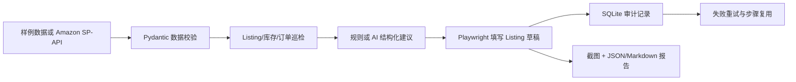

# AmazonOps AI

面向求职作品集的 **Amazon 运营智能巡检与 RPA 草稿助手**。系统把 Listing、FBA 库存和订单状态转成结构化运营建议，再用 Playwright 操作项目内置的 Seller Central 仿真页面，并保留任务步骤、失败重试、截图和报告证据。

默认演示不需要卖家账号和外部 API。项目同时集成开源 `python-amazon-sp-api` SDK，卖家授权后可以通过只读端点拉取 FBA 库存和非 PII 订单状态预览。

## 运行效果

| 作品集控制台 | Playwright 保存的 Listing 草稿 |
|---|---|
|  |  |

## 这个项目证明什么

| 能力 | 可演示证据 |
|---|---|
| RPA 自动化 | Playwright 自动填入 SKU、标题和五点描述，等待保存结果并生成截图 |
| Amazon 运营理解 | Listing 完整度评分、FBA 低库存阈值、超时订单识别、草稿审核流程 |
| 可靠任务编排 | 幂等键、步骤状态、错误记录、失败重试与已完成步骤复用 |
| AI 工程 | 确定性分析器保底；OpenAI-compatible 结构化输出和 Pydantic 强校验 |
| 真实接口准备 | `python-amazon-sp-api` 2.1.22 只读适配器、凭证就绪检查、官方字段契约测试 |
| 工程交付 | FastAPI/OpenAPI、SQLite、JSON/Markdown 报告、自动化测试和三分钟演示脚本 |

## 业务闭环



## 快速开始（Windows PowerShell）

```powershell
cd E:\projects\amazon-ops-ai
py -3.11 -m venv .venv
.\.venv\Scripts\python.exe -m pip install -r requirements.txt
.\.venv\Scripts\python.exe -m playwright install chromium
.\.venv\Scripts\python.exe -m pytest -q
.\.venv\Scripts\python.exe -m uvicorn app.main:app --host 127.0.0.1 --port 8000
```

打开 `http://127.0.0.1:8000/`。也可以在另一个终端运行：

> 如果改用其他端口，请同时设置 AMAZONOPS_BASE_URL，例如 http://127.0.0.1:8010，让 RPA 访问同一个本地服务。

```powershell
.\.venv\Scripts\python.exe scripts/demo.py
```

Demo 会完成一次正常任务，再制造一次浏览器步骤失败并重试。执行证据保存在 `artifacts/<task-id>/`，任务和步骤状态保存在 `data/amazon_ops.db`。

## Amazon SP-API 开源集成

项目使用 [`saleweaver/python-amazon-sp-api`](https://github.com/saleweaver/python-amazon-sp-api) 作为运行时 SDK，并参考 Amazon 官方 [`selling-partner-api-models`](https://github.com/amzn/selling-partner-api-models) 与 [`selling-partner-api-samples`](https://github.com/amzn/selling-partner-api-samples) 设计字段映射和契约测试。

未授权时，`GET /api/integrations/amazon/status` 只返回 SDK 版本、站点和缺失的变量名，不发 Amazon 网络请求。授权后在 `.env.local` 设置：

```ini
SP_API_REFRESH_TOKEN=
LWA_APP_ID=
LWA_CLIENT_SECRET=
SP_API_MARKETPLACE=US
```

然后调用 `POST /api/integrations/amazon/preview`。该端点只读取 FBA 库存与订单状态，不请求买家姓名、地址、电话等 PII，也不执行发布、调价、发货或退款。

## 可选 AI 分析

默认 `AMAZONOPS_ANALYZER=deterministic`，演示稳定且零模型成本。若要启用 OpenAI-compatible 结构化分析，在 `.env.local` 配置：

```ini
AMAZONOPS_ANALYZER=openai
OPENAI_API_KEY=
OPENAI_BASE_URL=https://api.openai.com/v1
OPENAI_MODEL=gpt-5.6-luna
OPENAI_API_MODE=responses
```

每个 SKU 必须返回且只能返回一条建议，标题和五点描述均经过 Pydantic 校验。模型接口失败时任务会记录可读错误，重试不会重复已经完成的数据校验步骤。

## API

- `GET /health`：应用、AI Provider 与 SP-API 就绪状态。
- `GET /api/catalog`：演示商品、库存、订单和风险摘要。
- `GET /api/integrations/amazon/status`：SP-API SDK 与凭证准备情况。
- `POST /api/integrations/amazon/preview`：授权后的只读 Amazon 数据预览。
- `POST /api/demo/run`：运行正常或受控失败的端到端任务。
- `GET /api/tasks`、`GET /api/tasks/{id}`：任务与步骤审计。
- `POST /api/tasks/{id}/retry`：恢复失败任务。
- `GET /api/tasks/{id}/report`：结构化运营报告。

## 项目边界

已验证的是本地业务闭环、开源 SDK 装载、Amazon 响应映射、无凭证保护和自动化测试。尚未连接真实卖家账号，因此不宣称完成 Amazon 生产环境联调。第三方组件及许可证见 [THIRD_PARTY_NOTICES.md](THIRD_PARTY_NOTICES.md)。
